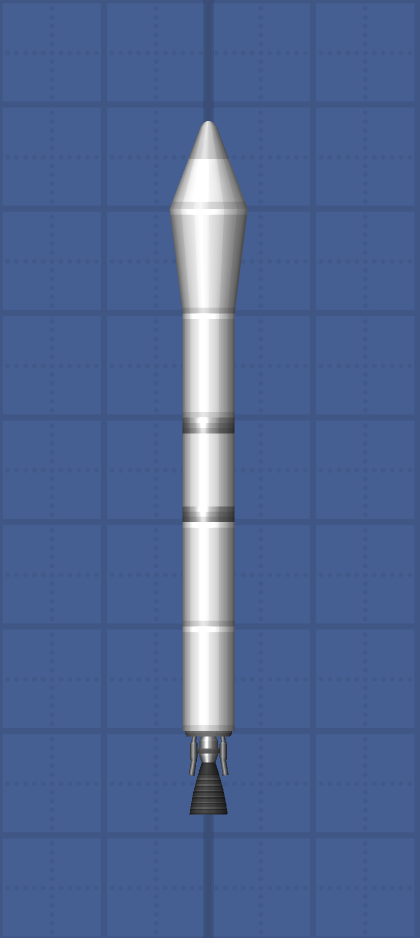
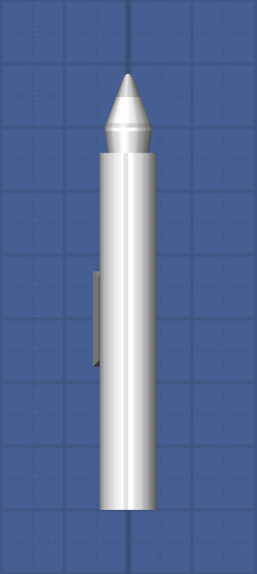
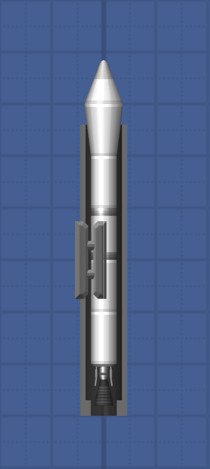

# Missy V1 Missile

## The Missile
The Missy V1 Missile is 1 x 7 Square big, and weighs ≈29t. Because the Blueprint JSON was modified, it's relatively small and effective.
It's thrusted by two sized down Titan Thrusters and generates 800t of thrust. That's a T/W of 27.55. 
The missile also contains a total of 8 RCS thrusters to keep it more stable.

## The Compact Launcher
The Compact Launcher is the same size as the missile itself. As the missile, 
The launcher was BP Edited too. You can attach the launcher by the side seperator.

 

## Table
| Syntax | Value |
| :-----------: | :-----------: |
| BP Edited | Yes |
| Size | 7 Squares |
| Mass | 29.03925t |
| Thrust | 800t |
| T/W | 27.55 |